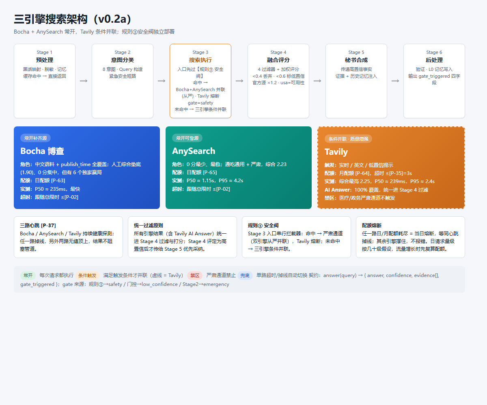

# v0.2a MVP 实施规划（草稿，待启用）

> 状态：**已启用，待 WP0 开工**｜编制：2026-08-12｜触发条件已满足：v0.1 `[P-07]` 10/10 通过并打 tag `v0.1`
> 基准：v0.1 实施规划 + 需求文档 v2.5 §4.4 / §6.8 / 附录 C
> 前置决策已全部确认：Tavily API Key（`.env` 已就位）、31 条意图覆盖、规则②测算口径
> 实施记录：2026-08-12 WP0 完成（Tavily 真实调用验证通过：E17 AI Answer 返回，E01 15s 下 1049ms 成功，3s 尾延迟超时保护生效）；WP1 31 条 query 集已生成（bench/v02a-queries.json，7 类意图全覆盖）；WP3 完成（条件并联触发 + AI Answer 注入 + 月配额 [P-64] + 严肃禁区，端到端 A 股行情验证通过）；WP4 完成（三路心跳 [P-37]，连续失败超窗才 down，61/61 单测）；WP2 完成测算（结论：正负例融合分重叠，[P-16]/[P-17] 暂不定稿维持 provisional，报告 bench/v02a-rule2-calibration.md）；WP6 自动部分完成（31 条三引擎全量跑通，报告 bench/v02a-report.md，[P-12] 相关性评分待人工回填）

---

## 0. 结论置顶（TL;DR）

1. **目标**：31 条全量基准 query 跑通三引擎搜索管道（Bocha + AnySearch 常开 + Tavily 条件并联），三规则全量落地，4 过滤器正式阈值定稿，三路心跳常开。
2. **验收标准**：[P-12]（31 条中 ≥80% 相关性达标且无 0 分硬答）。
3. **范围**：只做 §6.8 步 3（规则②阈值测算）+ 步 5（回灌观察期 + 三路心跳）+ Tavily 条件并联；不做 L2 蒸馏、MCP 子 Agent、证据链 UI。
4. **记忆**：沿用 v0.1 schema v1，无结构变更。
5. **技术栈**：在 v0.1 基础上新增 Tavily 适配器 + warmup + AI Answer 注入。

---

## 1. 目标与验收

| 项 | 定义 |
|----|------|
| 目标 | 31 条基准 query 全量跑通，三引擎条件并联 |
| 验收标准 | [P-12]：31 条中 ≥80% 相关性达标且无 0 分硬答 |
| 对应 §6.8 | 步 3 + 步 5（步 0-2、步 4 已在 v0.1 完成） |
| 架构冻结 | 步 0-5 完成后搜索架构本轮冻结，转入持续评测 |

## 2. 范围界定

### 2.1 做

| # | 交付物 | 对应规格 |
|---|--------|---------|
| 1 | Tavily 适配器 + 条件并联触发 | §6.2.1（实时/英文/低置信） |
| 2 | Tavily warmup | §6.2.1 warmup 策略 |
| 3 | Tavily AI Answer 注入 | §6.2.1 / §12.12.0 resolveFact |
| 4 | 规则② 置信度阈值测算 | §6.6（前置：P0 干净标定集 + 4 过滤器后分数，分领域） |
| 5 | 三路心跳健康检查 | §6.2.2 |
| 6 | 4 过滤器正式阈值定稿 | §6.5（基于 31 条标定） |
| 7 | 回灌观察期 | §6.8 步 5（领域 ≥[P-11] 条才允许动参） |

### 2.2 不做

- ❌ L2 蒸馏（memory-core sidecar）——v0.2b
- ❌ ExperienceManager / Skill 生命周期治理——v0.2b
- ❌ MCP 子 Agent / 执行门 / 证据链 UI——v1.0

## 3. WBS（草稿，依赖图为串行 + 并行）

| WP | 任务 | 依赖 | 验收 |
|----|------|------|------|
| WP0 | Tavily 准备：Key 获取、配额确认 [P-64]、warmup 开关 | 无 | 单次真实调用成功 + warmup 日志 |
| WP1 | 31 条 query 集：从 raw_scores.csv 生成 v02a-queries.json | WP0 | 31 条覆盖 7 类意图（含 news/github_analysis） |
| WP2 | 规则② 阈值测算：分领域阈值表 | v0.1 步0/1 产物 | 高置信 [P-17] / 丢弃 [P-16] 定稿或 provisional |
| WP3 | Tavily 适配器 + 条件并联 + AI Answer 注入 | WP1 | 单测：三触发条件 + 医疗/政务禁区不触发 |
| WP4 | 三路心跳健康检查 | WP3 | 任一路掉线由另外两路无缝顶上 |
| WP5 | 回灌观察期 + 持续评测 | WP2-4 | 领域 ≥[P-11] 条才动参，记录回灌日志 |
| WP6 | 全量验收：31 条跑通 + [P-12] 判定 + 回归报告 | WP3-5 | 31 条中 ≥80% 达标且无 0 分硬答 |

## 4. 关键参数引用

| 场景 | 引用 |
|------|------|
| 31 条通过率 | [P-12] |
| Tavily 配额/超额 | [P-64]/[P-77] |
| Tavily 超时保护 | [P-35] |
| Tavily 冷启动延迟 | [P-36] |
| 掉线检测窗口 | [P-37] |
| 置信阈值 | [P-16]/[P-17] |
| 回灌阈值 | [P-11] |
| 复验门（v0.1 遗留） | E1（P-04）/ E2（P-02）n≥30 |

## 5. 风险与对策

| 风险 | 等级 | 对策 |
|------|------|------|
| Tavily Key 未配置 | 🔴 | 决策点：免费注册或暂用现有；未启用前 WP0 阻塞 |
| Tavily 医疗/政务 0 分 | 🔴 | §6.2.1 禁区硬规则 + 规则②从严阈值（v0.1 已验证） |
| 规则②阈值样本不足 | 🟡 | 31 条分领域测算，provisional，WP11 复验门 |
| AnySearch 尾延迟 | 🟡 | E2 复验门：n≥30 超时率 >30% 重开决策 |
| 31 条意图覆盖偏差 | 🟡 | WP1 从附录 C.3 直接取全量，覆盖 7 类意图 |

## 6. 待拍板决策点（启用前）

1. **Tavily API Key**：✅ 已确认 `.env` 含 `TAVILY_API_KEY`（未注释、有值）；启用前做一次真实调用验证（[P-64] 月配额）。
2. **31 条意图覆盖**：✅ 已确认直接用附录 C.3 全部 31 条（与选型数据同源）。
3. **规则②测算口径**：✅ 已确认按文档 §6.6“0 分案例 vs ≥2 分案例，过滤后分数分布取分界点”，分医疗/政务从严、生活从宽。

---

## 附录：三引擎搜索架构图

### A.1 老板/非技术视图（彩图）



> 彩图源文件：`docs/three-engine-architecture.html`（可改配色/文案重新出图）。

### A.2 开发/测试视图（ASCII 详细框图）

<details><summary>展开 ASCII 详细框图</summary>

```text
用户输入
  │
  ▼
┌──────────────────────────────────────────────────────────────┐
│ Stage 1 预处理（≤[P-20] 300ms）                               │
│ 黑话映射 → 脱敏 → 记忆调用(L0) → 缓存检查                     │
│ 缓存命中 → 早退直接返回（跳过 Stage 2–5）                     │
└──────────────────────────────┬───────────────────────────────┘
                               ▼
┌──────────────────────────────────────────────────────────────┐
│ Stage 2 意图分类 + Query 构造（≤[P-04] 2000ms provisional）   │
│ 8 意图 · 紧急安全短路 · 失败降级 factual                       │
└──────────────────────────────┬───────────────────────────────┘
                               ▼
┌──────────────────────────────────────────────────────────────┐
│ Stage 3 搜索执行（≤[P-02] 5s）                                │
│                                                              │
│  ① 规则③ 安全阀（入口串行拦截，独立于分类器）                  │
│     命中 药品/税率/法规/统计口径？                            │
│       ├─ 是 → 严肃通道：Bocha+AnySearch 并联（从严阈值）       │
│       │        Tavily 熔断 [gate_triggered=safety]            │
│       └─ 否 → 三引擎条件并联                                 │
│                                                              │
│  ② 三引擎条件并联（任一超时另一路兜底）                       │
│     ┌──────────────┐  ┌───────────────┐  ┌──────────────────┐│
│     │ Bocha        │  │ AnySearch     │  │ Tavily           ││
│     │ 常开补齐源   │  │ 常开可靠源    │  │ 条件并联·质量增强 ││
│     │ 综合1.90垫底 │  │ 0分最少·最稳  │  │ 综合2.25最高     ││
│     │ 6个独家赢局  │  │ 综合2.23      │  │ AI Answer 100%   ││
│     │ [P-63]日     │  │ [P-65]日      │  │ [P-64]月         ││
│     │ ≤[P-02]      │  │ ≤[P-02]       │  │ ≤[P-35]=3s       ││
│        └──────┬────┘  └───────┬────┘  └────────┬──────┘      │
│               └───────────────────┼──────────────────┘       │
│                       (三路心跳互备 [P-37]=5s)                │
│    Tavily 触发：news / 英文技术 / 低置信提示                  │
│    所有结果（含 AI Answer）统一送 Stage 4，无直连 Stage 5      │
│    配额耗尽（429/日限）= 当日熔断，等同心跳掉线，不报错        │
│    （其余引擎顶上；日请求量级假设几十级，增长先复算配额）       │
└──────────────────────────────┬───────────────────────────────┘
                               ▼
┌──────────────────────────────────────────────────────────────┐
│ Stage 4 融合评分（≤[P-05] 1s，纯本地）                         │
│ ① 实体精确匹配（不匹配丢弃）                                  │
│ ② 跨引擎去重（URL + 内容 hash）                               │
│ ③ SEO 垃圾页识别（降权 ×0.5）                                │
│ ④ 分类时效加权（意图动态权重 [P-23]）                         │
│ final = w_rel·rel + w_time·time + w_usa·usa + w_fact·fact     │
│ (rel=相关性, time=时效, usa=可用性, fact=事实一致性)           │
│ 官方源 ×1.2（[P-18]）· 规则① fact_consistency 仲裁            │
│ [P-16] <0.4 → 丢弃                                           │
│ [P-17] <0.6 → 标注低置信（Stage 5 降权引用）                  │
│ 输出标签：高置信事实（含 Tavily AI Answer 经统一评分后的）     │
└──────────────────────────────┬───────────────────────────────┘
                               ▼
┌──────────────────────────────────────────────────────────────┐
│ Stage 5 秘书合成（≤[P-06] 8s，DeepSeek）                      │
│ 传递高置信事实 + 历史记忆 → 中文秘书答案                       │
│ 严肃通道追加“以官方/专业人士为准”                             │
│ 无证据/低置信 → 不硬答                                        │
└──────────────────────────────┬───────────────────────────────┘
                               ▼
┌──────────────────────────────────────────────────────────────┐
│ Stage 6 后处理（≤[P-21] 1s）+ L0 记忆写入                      │
│ 验证 answer · confidence 钳制 · evidence_hash                 │
│ 输出契约：                                                    │
│   answer(query) → { answer, confidence, evidence[],           │
│                     gate_triggered }                          │
│   gate_triggered ∈ {none, emergency, low_confidence, safety}  │
│   （safety=规则③，low_confidence=[P-17]门控，                 │
│     emergency=Stage 2 紧急安全短路）                          │
└──────────────────────────────────────────────────────────────┘
```

</details>

### A.3 阈值速查

| 参数 | 值 | 用途（固定 Stage 预算见各框标题） |
|---|---|---|
| [P-16] | 0.4 | 融合分低于则丢弃 |
| [P-17] | 0.6 | 低于则标低置信，合成降权引用 |
| [P-18] | 1.2 | 官方源融合分乘数 |
| [P-23] | 7 意图权重表 | Stage 4 动态权重（github_analysis 走 default；emergency 短路不进 Stage 4） |
| [P-37] | 5s | 心跳掉线检测窗口 |
| [P-02] | 5s | Stage 3 总预算（provisional，E2 复验门） |
| [P-04] | 2000ms | Stage 2 预算（provisional，E1 复验门） |
| [P-35] | 3s | Tavily 超时保护 |
| [P-05] | 1s | Stage 4 结果处理预算 |
| [P-06] | 8s | Stage 5 秘书合成预算 |
| [P-20] | 300ms | Stage 1 预处理预算 |
| [P-21] | 1s | Stage 6 后处理预算 |
| [P-63]/[P-65]/[P-64] | 100/日 · 1000/天 · 1000/月 | 三引擎配额（日量级假设几十级） |

---

*本文档为 v0.2a 草稿，未启用；一切规格冲突以 `一人公司AI-Agent需求文档_v2.5.md` 为准。*
